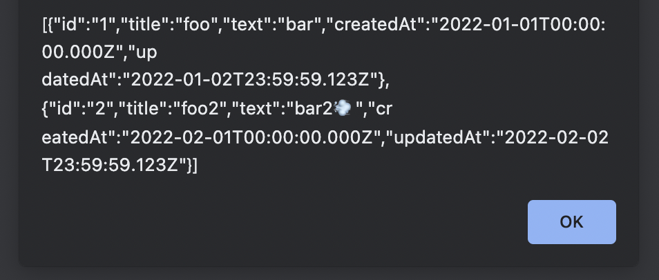

# csv-parse-v
[](https://github.com/shinshin86/csv-parse-v/actions/workflows/test.yml)


ES Modules style CSV Parser

## Install

```sh
# npm
npm i --save csv-parse-v

# yarn
yarn add csv-parse-v

# pnpm
pnpm add csv-parse-v

# bun
bun install csv-parse-v
```

## Usage

```javascript
import parse from 'csv-parse-v';

const csv = `id,title,text,createdAt,updatedAt
1,foo,bar,2022-01-01T00:00:00.000Z,2022-01-02T23:59:59.123Z
2,foo2,bar2💨,2022-02-01T00:00:00.000Z,2022-02-02T23:59:59.123Z`;

const result = parse(csv);
console.log(result);
```

For use within HTML (use `esm` sample).

```html
<html>
  <head>
    <meta charset="UTF-8">
    <script type="module">
      // Use esm.sh
      import parse from 'https://esm.sh/csv-parse-v';

      const csv = `id,title,text,createdAt,updatedAt
1,foo,bar,2022-01-01T00:00:00.000Z,2022-01-02T23:59:59.123Z
2,foo2,bar2💨,2022-02-01T00:00:00.000Z,2022-02-02T23:59:59.123Z`;

      const result = parse(csv);
      alert(JSON.stringify(result));
    </script>
  </head>
  <body>
  </body>
</html>
```



### Deno
This is a sample for use with Deno.  
(Deno version must be `1.25` or higher.)

```typescript
import parse from "npm:csv-parse-v";

const csv = `id,title,text,createdAt,updatedAt
1,foo,bar,2022-01-01T00:00:00.000Z,2022-01-02T23:59:59.123Z
2,foo2,bar2💨,2022-02-01T00:00:00.000Z,2022-02-02T23:59:59.123Z`;

const result = parse(csv);
console.log(result);
```

## Development

### Test

```sh
npm run test
```

### Code format

Use `deno fmt`.

```sh
npm run fmt
```

## License

MIT

## Author

[Yuki Shindo](https://shinshin86.com/en)
